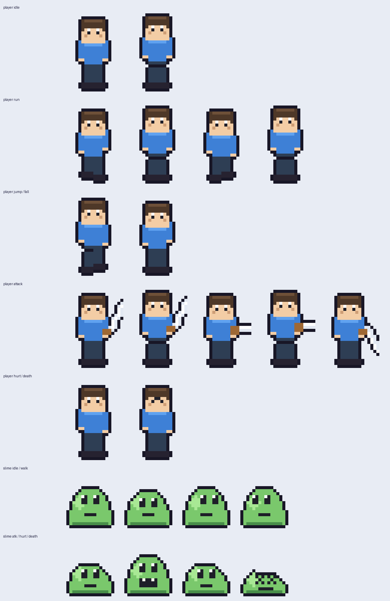
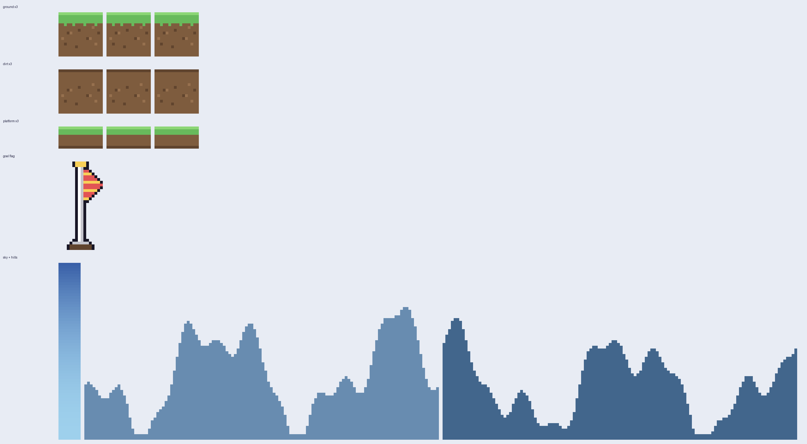

# 勇者闯关｜Unity 2D 横版动作游戏

一个使用 Unity 制作的像素风 2D 横版闯关项目。玩家需要跨越地形、击败史莱姆并抵达终点旗帜，依次完成两个关卡。

项目重点不只是实现可玩的关卡，还将角色控制、战斗、敌人 AI、关卡流程和编辑器生成工具拆分为清晰模块，方便继续扩展和学习。

## 项目特色

- 玩家有限状态机：待机、移动、跳跃、下落、攻击、受伤、死亡
- 更自然的跳跃手感：土狼时间、跳跃输入缓冲、长短跳和下落加速
- 敌人 AI 状态机：巡逻、发现、追击、攻击、受伤、死亡
- 基于动画事件的攻击判定、受击反馈和击退效果
- 两个完整关卡，以及主菜单、HUD、胜负结算和淡入淡出转场
- 相机跟随、前视偏移、边界限制、屏幕震动和多层视差背景
- 运行统计：通关时间、击杀数和死亡次数
- Unity 编辑器一键生成像素美术、动画、Prefab、场景和 Build Settings

## 美术预览

### 角色动画



### 场景素材



## 操作方式

| 操作 | 按键 |
| --- | --- |
| 左右移动 | `A` / `D` 或 `←` / `→` |
| 跳跃 | `Space` 或 `W` |
| 攻击 | `J`、`K` 或鼠标左键 |

## 技术栈

- Unity `2022.3.62f2`
- C#
- Unity 2D Physics / Animator / UGUI
- 像素美术由项目内编辑器工具生成，不依赖第三方素材包

## 运行项目

1. 安装 Unity Hub 与 Unity `2022.3.62f2`（同一 2022.3 LTS 版本通常也可打开）。
2. 克隆仓库并使用 Unity Hub 打开项目根目录。
3. 等待 Unity 自动恢复 `Library` 和包缓存。
4. 打开 `Assets/Generated/Scenes/MainMenu.unity`，点击 Play。

如果需要从代码重新生成全部资源，在 Unity 菜单中执行：

`Tools > 2D闯关游戏 > ① 一键生成全部（推荐）`

## 代码结构

```text
Assets/
├─ Scripts/
│  ├─ Core/       # 游戏流程、状态机、转场
│  ├─ Player/     # 玩家控制、输入、状态与生命值
│  ├─ Enemy/      # 敌人 AI、状态与攻击
│  ├─ Combat/     # 通用生命值、伤害与命中盒
│  ├─ Level/      # 终点和死亡区域
│  ├─ UI/         # 主菜单、HUD、血条和结算界面
│  └─ Utils/      # 相机、视差和通用工具
├─ Editor/        # 一键生成美术、动画、Prefab 与场景的工具
└─ Generated/     # 可直接运行、也可重新生成的游戏资源
```

## 设计说明

- 逻辑状态机控制角色“当前能做什么”，Animator 状态机负责“当前播放什么”。
- 玩家与敌人共享轻量状态机骨架，但各自拥有独立状态实现，降低耦合。
- 关卡布局用数据结构描述，再由编辑器脚本生成场景，便于快速调整和扩展。
- `Library/`、`Logs/`、`UserSettings/` 等本机生成目录不会提交到版本库；克隆后由 Unity 自动恢复。

## 当前内容

- 2 个可玩关卡
- 1 套玩家像素动画
- 1 套史莱姆敌人动画
- 完整的开始、闯关、结算和重玩流程

这是一个持续完善中的个人作品集项目。
